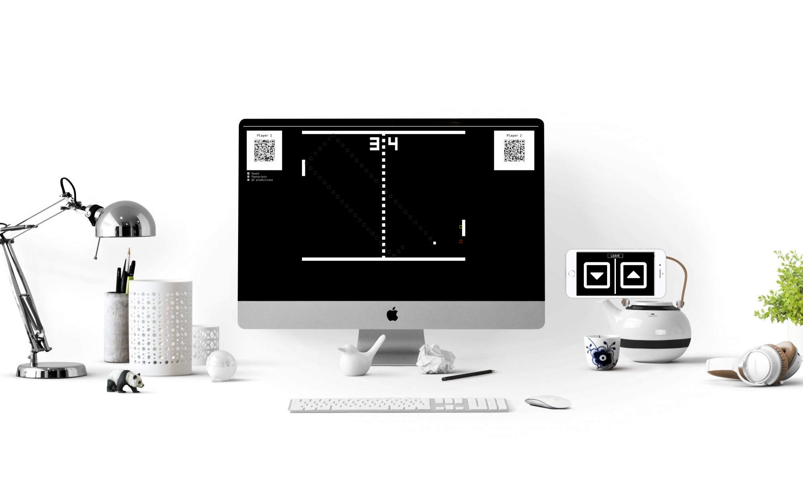

#  Pong in Node.js 

This is a fork of [deepstreamIO/ds-demo-pong](https://github.com/deepstreamIO/ds-demo-pong) wich is a fork of [gburnett/javascript-pong](https://github.com/gburnett/javascript-pong) which is a fork of [jakesgordon/javascript-pong](https://github.com/jakesgordon/javascript-pong), a tutorial for implementing a Pong game.

## Tutorials
 - [pong game in node.js](https://codeincomplete.com/posts/javascript-pong/)
 - [adding deepstream.io](https://codeforgeek.com/building-pong-game-using-deepsteam-io/)

## Screenshot

